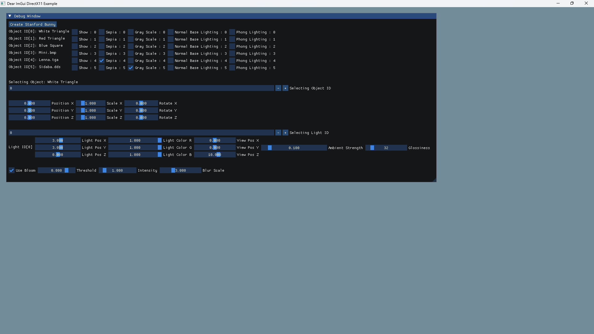
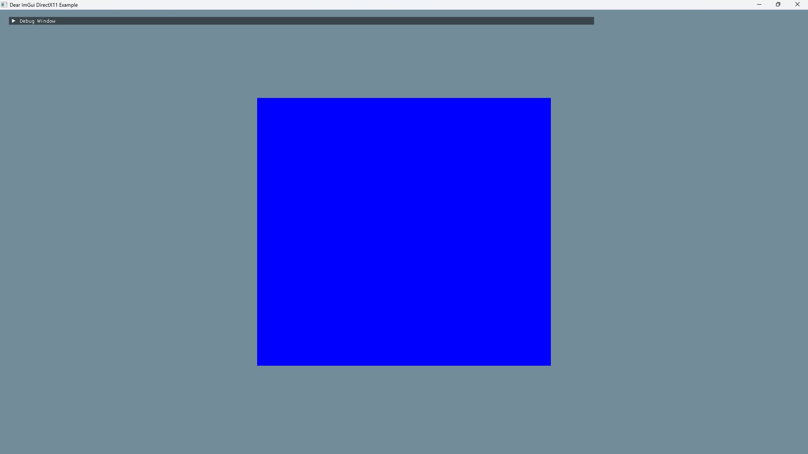
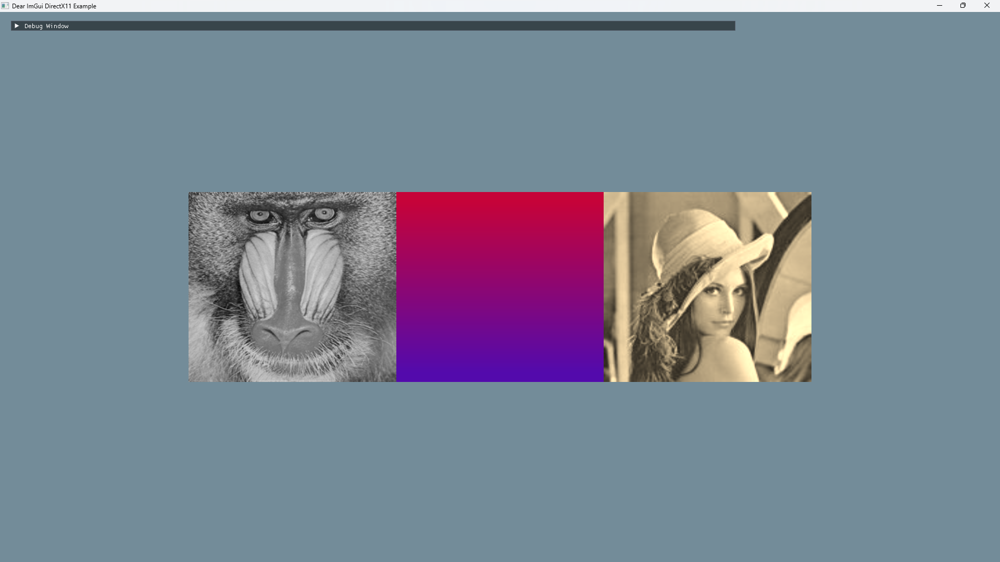
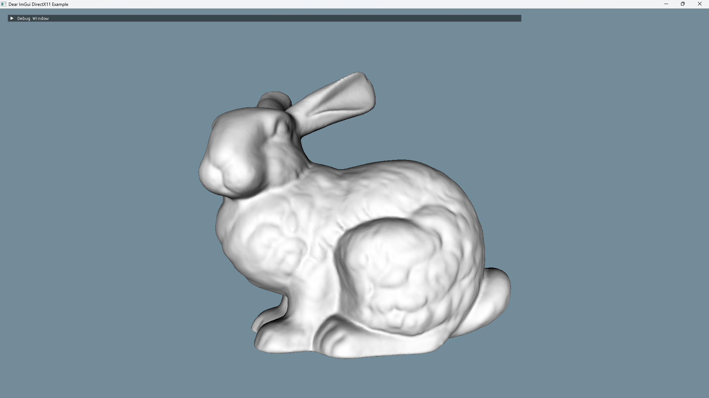
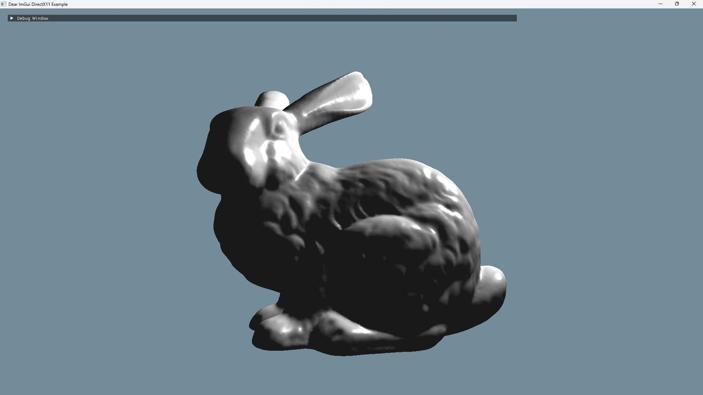
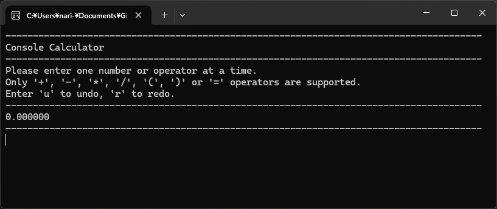
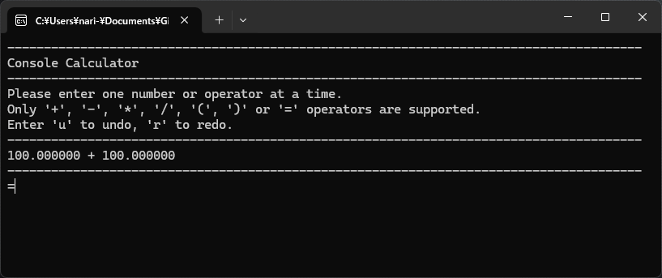
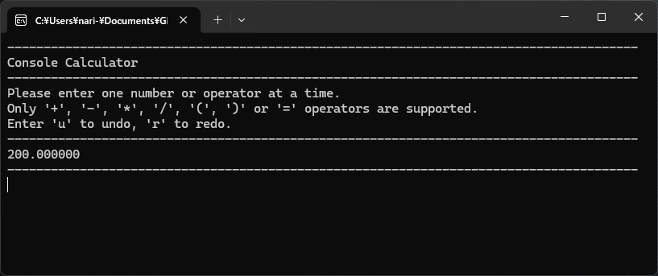
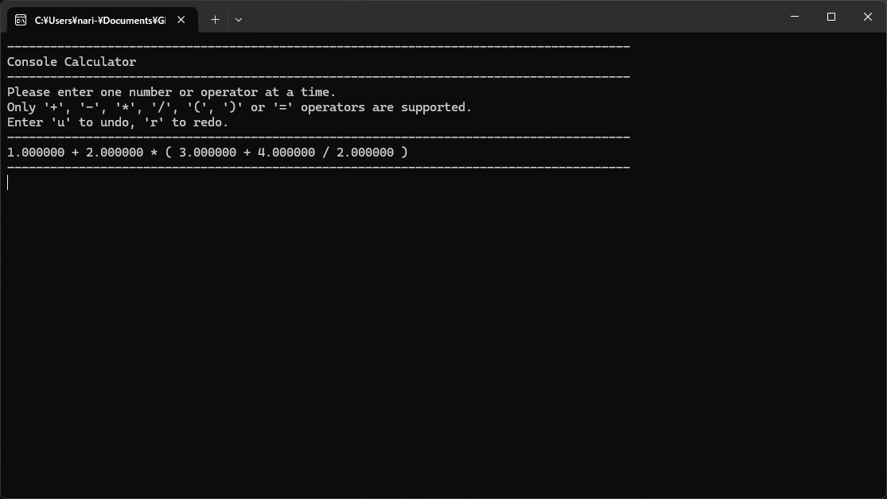

# Intern
インターンの成果物のうち、公開可能な成果物らをまとめたリポジドリ。

## 2025年度1月臨地実務実習
以下らを作成した。レポートは[2025年1月臨地実務実習レポート.pdf](reports/2025年1月臨地実務実習/2025年1月臨地実務実習レポート.pdf)になる。

### Image Format Converter
[image_format_converter.sln](../image_format_converter/image_format_converter.sln)から`image_format_converterプロジェクト`をビルドし、実行する。コマンドラインから以下のように入力しても実行できる。
```
image_format_converter.exe /i 入力画像ファイルパス /o 出力画像ファイルパス
```
BMP、TGA、DDSファイルらの相互画像形式変換を行うことができる。

### Mesh Viewer with ImGui
[imgui_examples.sln](../imgui-master\examples\imgui_examples.sln)から`example_win32_directx11プロジェクト`をビルドし、実行する。Direct3D11及び、ImGuiを使用しており、Debug Windowを操作し、四角形や画像、Stanford Bunnyの描画を行える。







### Console Calculator
[console_calculator.sln](../console_calculator/console_calculator.sln)から`console_calculatorプロジェクト`をビルドし、実行する。コマンドパターンを使用したUndo、Redo機能や、逆ポーランド記法を使用した演算順序付きの計算を行える。




